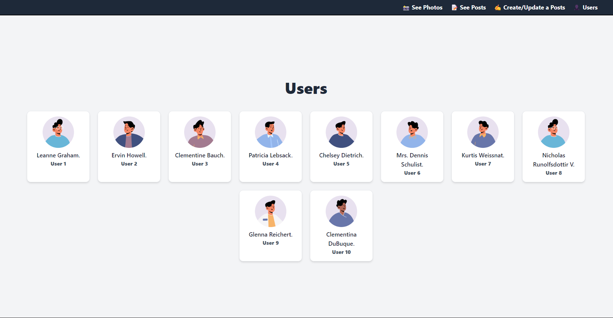
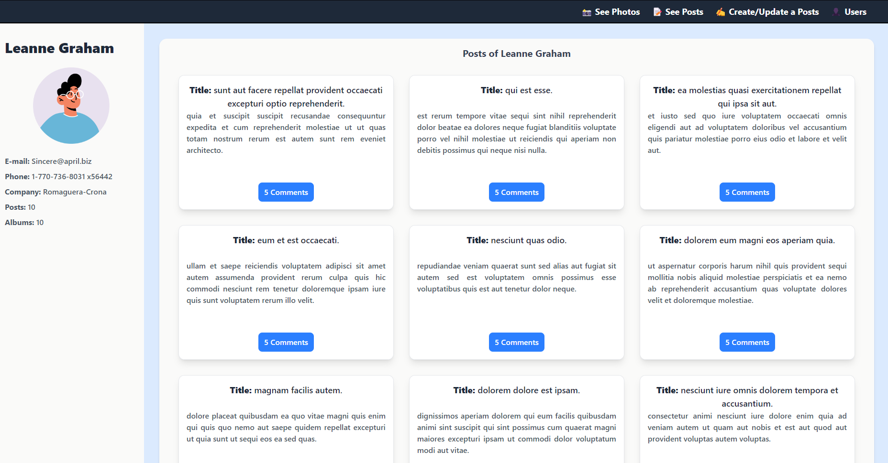
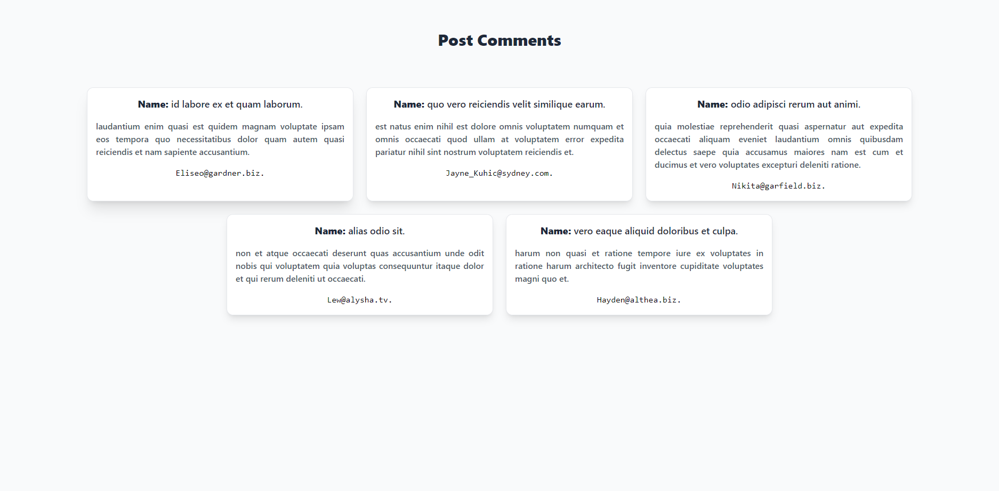
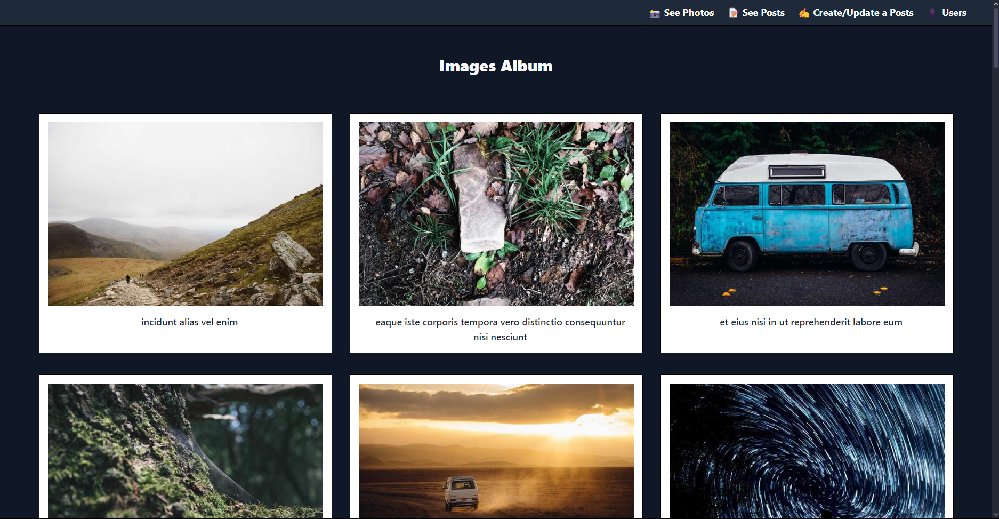
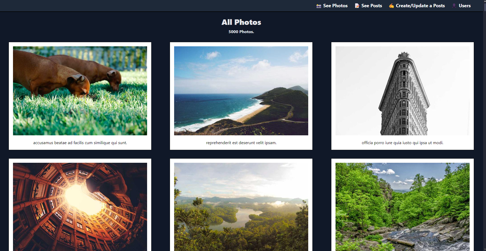
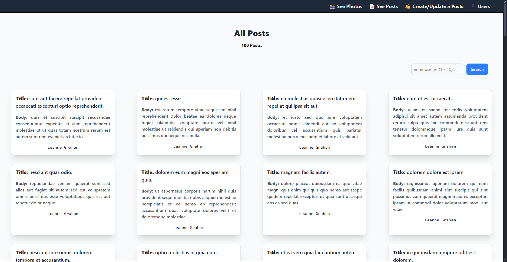
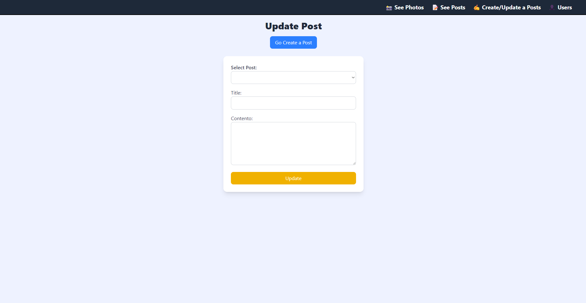

# 🛠️ UserManager

UserManager es una aplicación desarrollada con `Vue 3`, `Pinia` y `Vue Router` que permite gestionar usuarios consumiendo la `API de JSONPlaceholder`.

Este proyecto es parte de mi trabajo final, en el que demuestro los conocimientos adquiridos durante mi estudio de ``Vue``.

## 🚀 Tecnologías utilizadas

- 🟢 **Vue 3** - Framework progresivo de JavaScript.
- 🟡 **Pinia** - Gestión de estado.
- 🔀 **Vue Router** - Enrutamiento.
- 📡 **Axios** - Para consumir las APIs necesarias.
- 🎨 **Tailwind CSS (opcional)** - Estilización rápida y moderna.

## 📥 Instalación y configuración

1. 🔹 Clona el repositorio:
``` bash
git clone https://github.com/Eduarvallejos/aprendiendo-a-usar-Vue.js/tree/master/vue-pinia-crud

cd vue-pinia-crud
```
2. 📦 Instala las dependencias:
``` bash
npm install
```
3. ▶️ Inicia el servidor de desarrollo:
``` bash
npm run dev
```
## ✨ Características

- 📋 Listar usuarios desde JSONPlaceholder.
- 🔍 Ver detalles de un usuario específico.
- 📝 Crear, editar y eliminar posts (simulación en frontend).
- 🔄 Navegación entre vistas con Vue Router.
- ⚡ Gestión de estado global con Pinia.
- 🖼️ Soporte para fotos de perfil de usuario

## 📂 Estructura del proyecto

``` bash
UserManager/
├── src/
│   ├── components/  # 🧩 Componentes reutilizables
│   ├── views/        # 🏠 Vistas principales (Home, UserDetail, etc.)
│   ├── store/        # 📦 Configuración de Pinia
│   ├── router/       # 🛤️ Configuración de Vue Router
│   ├── main.js       # 🚀 Punto de entrada de la aplicación
│   ├── App.vue       # 🎨 Componente principal
│
├── public/           # 📁 Archivos estáticos
├── package.json      # 📜 Dependencias y scripts
└── README.md         # 📖 Documentación del proyecto

```

## 🖼️ Manejo de Fotos de Perfil

Los usuarios pueden tener fotos de perfil. Debido a que JSONPlaceholder ya no proporciona imágenes, se utilizan otras APIs para obtener imágenes de usuarios y fotos de perfil de manera dinámica.

- 📷 Fotos de usuario obtenidas desde `https://avatar.iran.liara.run`.
- 🖼️ Imágenes generados con `https://picsum.photos` u otros servicios similares.


## 📸 Capturas de Pantalla

### 🏠 Página de Inicio, 📋 Lista de Usuarios


### 🔍 Detalles de Usuario


### 💬 Comentarios de un Post


### 🖼️ Imágenes de un Álbum


### 📷 Todas las Fotos


### 💭 Todos los Comentarios


### ✏️ Crear/Actualizar Posts



## 🌍 Proyecto en Producción

Puedes ver el proyecto funcionando en el siguiente enlace:
🔗 **[UserManager - Versión Desplegada](https://practicando-vue3.netlify.app)**

## 🔗 APIs utilizadas

Se utilizan diversas APIs para obtener información y recursos:

- 🌐 *Obtener usuarios*: https://jsonplaceholder.typicode.com/users
- 🔗 *Obtener un usuario por ID*: https://jsonplaceholder.typicode.com/users/{id}
- 📷 *Obtener fotos de perfil*: https://avatar.iran.liara.run
- 🖼️ *Obtener imágenes aleatorias*: https://picsum.photos/

## 🤝 Contribución

Si deseas contribuir al proyecto, sigue estos pasos:
1. 🍴 Haz un `fork` del repositorio.
2. 🌿 Crea una nueva rama (`git checkout -b feature-nueva-funcionalidad`).
3. 🛠️ Realiza tus cambios y haz commit (`git commit -m 'Agrega nueva funcionalidad'`).
4. ⬆️ Sube los cambios (`git push origin feature-nueva-funcionalidad`).
5. 🔄 Crea un Pull Request.

## 📜 Licencia
Este proyecto está bajo la licencia MIT. Puedes usarlo, modificarlo y distribuirlo libremente. 🚀